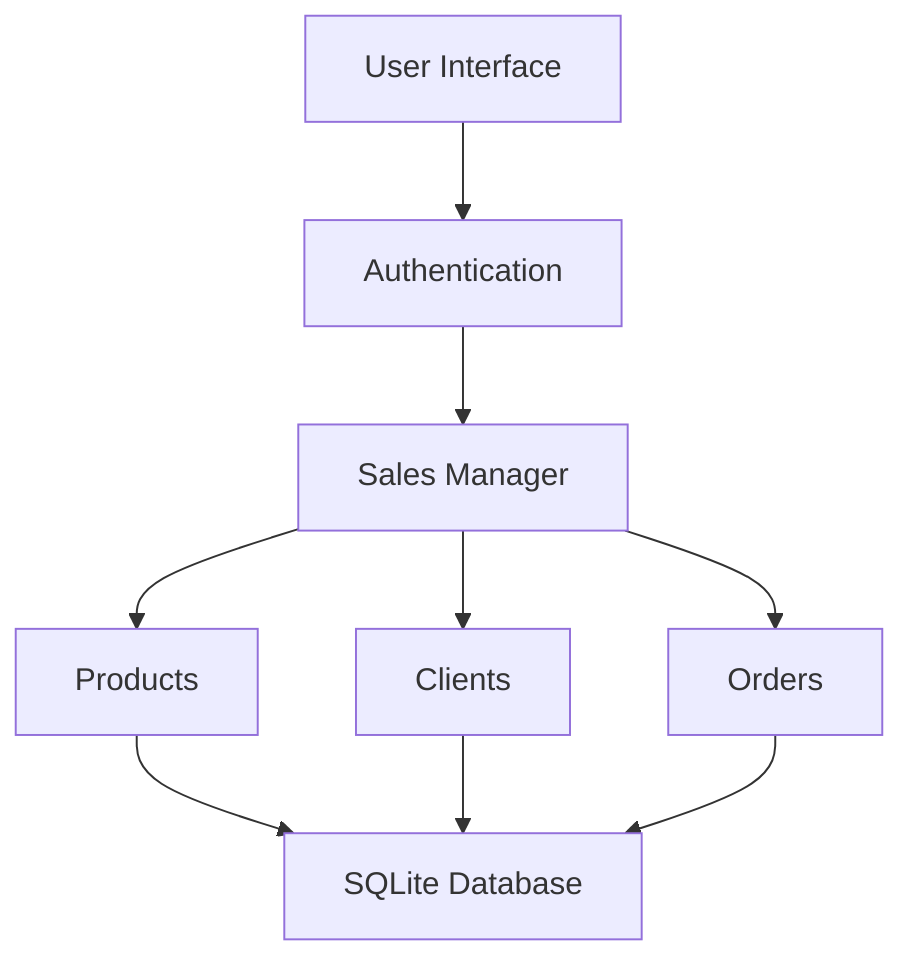

# 💼 Sales Management System

[](https://github.com/Raul-Dumitrele/Oriented-Object-Programing/actions)


> A desktop application built with Python and SQLite to manage products, clients, and sales using clean Object-Oriented Programming principles and a simple graphical interface.

---

## 🚀 Project Overview

- Manage **products, clients, and orders** with full CRUD functionality  
- **User authentication** with encrypted passwords (Admin / Seller roles)  
- **Product categorization** and **discount management**  
- **Low-stock notifications** and **sales statistics**  
- **Data persistence** using SQLite database  
- Designed with OOP structure: `Product`, `Client`, `Order`, and `Sales` classes  

---

## 🏗️ Architecture



---

## 🔧 Installation

```bash
git clone https://github.com/Raul-Dumitrele/Oriented-Object-Programing.git
cd "Oriented-Object-Programing/Sales Management System-Python"
pip install -r requirements.txt
```

---

## ⚙️ How to Run

```bash
python main.py
```

You’ll be prompted with the login interface. Default users can be set directly in the SQLite database or through the registration system.

---

## 🧪 Example Usage

Once logged in as an **Admin**, you can:

- Add or remove products  
- Create and view orders  
- Manage clients  
- Check stock alerts and discounts  

---

## 📂 Project Structure

```
Sales Management System-Python/
├── main.py                  # Entry point
├── database.db              # SQLite database
├── product.py               # Product class
├── client.py                # Client class
├── order.py                 # Order class
├── sales.py                 # Core system logic
└── README.md                # This file
```

---

## 🧠 Technologies Used

| Component         | Purpose                                              |
|--------------------|------------------------------------------------------|
| **Python 3.10+**   | Main implementation language                        |
| **SQLite**         | Database engine for data persistence                 |
| **Tkinter**        | GUI framework for the desktop interface              |
| **OOP Principles** | Code organization and maintainability                |

---

## 🤝 Contributions

Contributions are welcome!  
If you’d like to improve the app, fix bugs, or add new features:

1. Fork this repository  
2. Create a new branch (`feature/your-feature-name`)  
3. Commit your changes  
4. Open a Pull Request  

---

## 📌 FAQs

**Q:** How are passwords stored?  
**A:** Passwords are encrypted using hashing before saving in the database.

**Q:** Can I add new user roles?  
**A:** Yes — roles are stored in the database and can be extended with minimal changes to logic.

---

## ⭐ Support the Project

If you find this project useful, give it a ⭐ on GitHub!

---

## 🔗 Repository Link

[Sales Management System – GitHub Repository](https://github.com/Raul-Dumitrele/Oriented-Object-Programing/tree/main/Sales%20Management%20System-Python)

---

## 👤 Author

**Raul Dumitrele**  
[GitHub Profile](https://github.com/Raul-Dumitrele)
